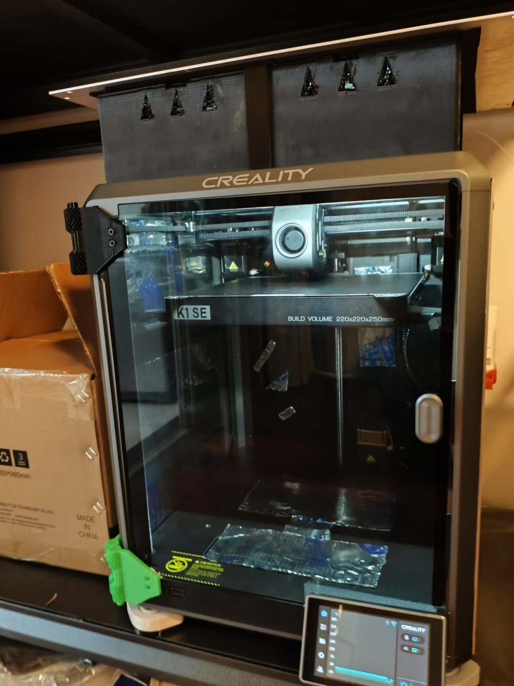
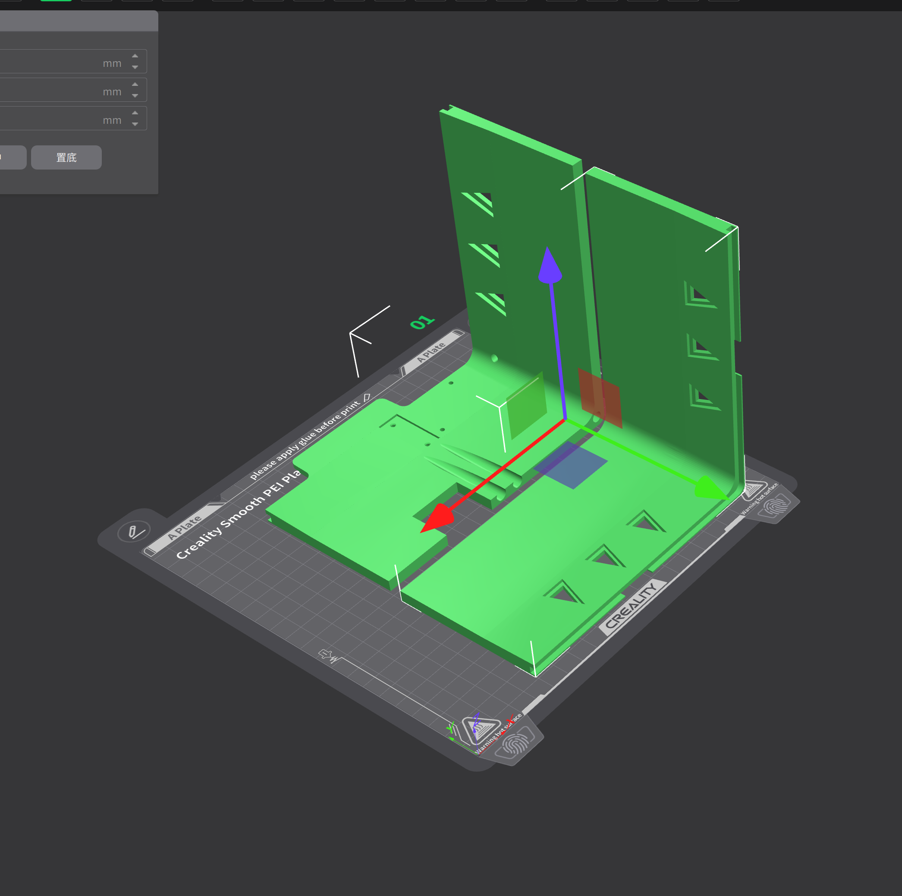
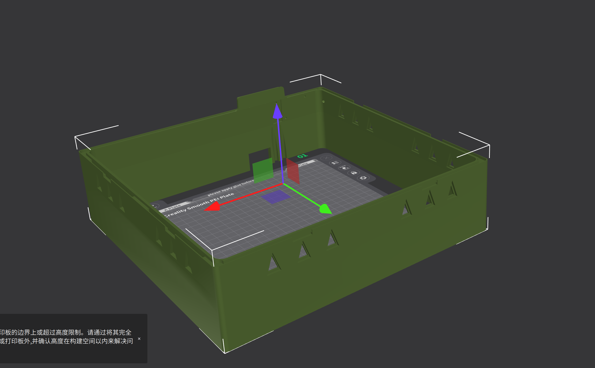
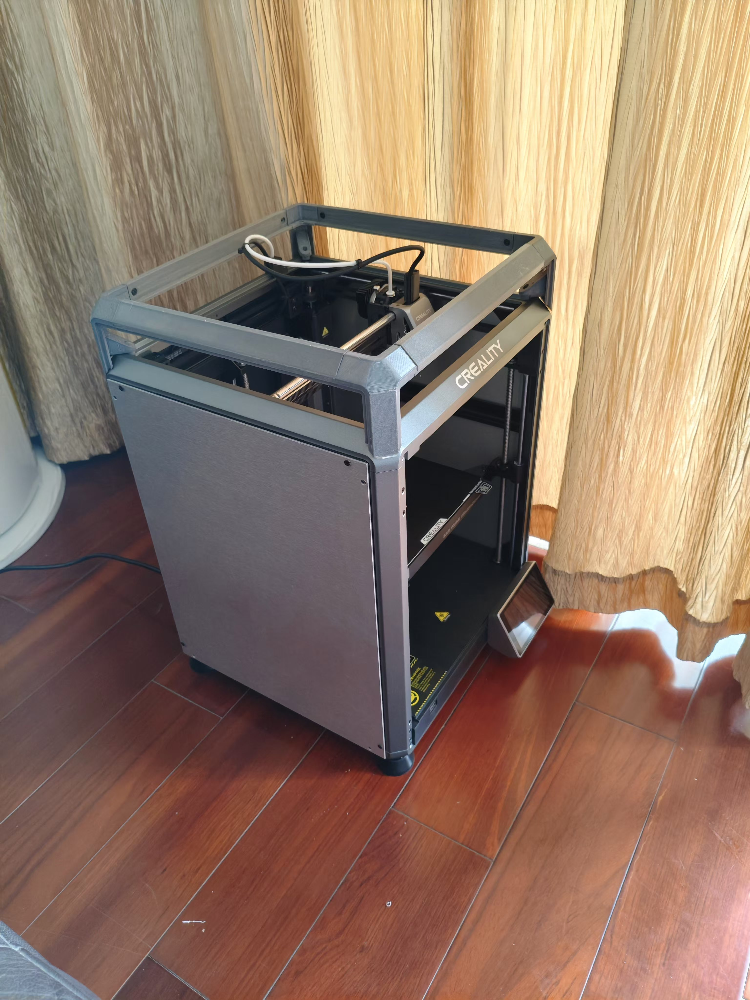
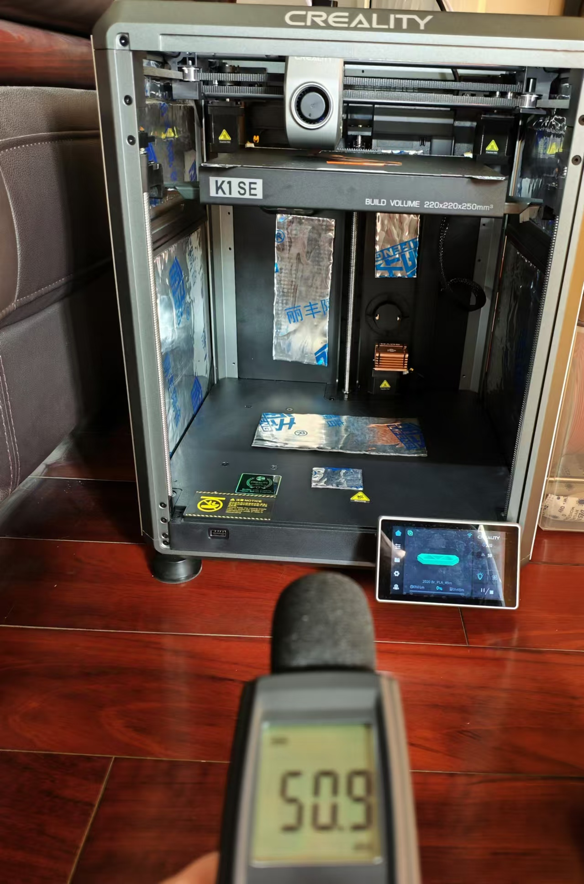

Now, we have 50dB 3d printer（施工ing）
---
目前已经完成：

1.侧板孔位的测绘（图纸在doc目录下）

2.侧板和电器仓止震措施

3.喉管冷却风扇的调教

4.封箱上盖

5.ab电机的主动降噪

6.前门合页（基于https://www.printables.com/model/876928-creality-k1k1ck1-max-door-hinges-geared-remix的修改），放置在stl/k1se_door_hinges下
```
printer.cfg参数
[heater_fan hotend_fan]
pin: multi_pin:heater_fans
heater: extruder
heater_temp: 40
heater_temp: 40.0
fan_speed: 0.7       # 确保 fan_speed 值在 0.0 到 1.0 范围内
max_power: 1.0
kick_start_time: 0.5
```
4.更加均匀的冷却风嘴，基于https://www.printables.com/model/797223-creality-k1-silent-toolhead-covers-5015-or-5020-fa

5.热床调平

接下来。。。。。


1.封箱
---
两侧侧板的测绘图纸我存放在了doc目录下，封箱上盖改编自[Cover Lift](https://www.printables.com/model/989984-creality-k1c-minimalistic-cover-lift/files)，
我提供了完整的st
l图纸，也提供了被切割可以被k1SE打印的stl文件，stl文件存放在stl目录下。

大致的情况：







暂时的图片：






